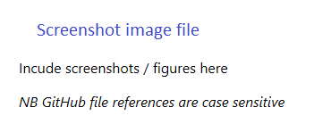

# Repository name

**NOTICE:**

All of the content provided in this repository is **classified as Wacom Confidential Material**, therefore the signed NON-DISCLOSURE AGREEMENT applies.
Be aware that the **technology components are still under active development** with minimal QA testing, and **API interfaces and functionality could be changed or removed**.

*Notice for GSV related products*

**NOTICE:**

All of the content provided in this repository is **classified as Wacom Confidential Material**, therefore the signed NON-DISCLOSURE AGREEMENT applies.
Be aware that the **technology components are still under active development** with minimal QA testing, and **API interfaces and functionality could be changed or removed**.
Moreover, the legal framework is not yet finalised, thus the service **MUST BE USED ONLY FOR ACADEMIC PURPOSE AND NOT WITH CUSTOMER DATA. WACOM DOES NOT STORE ANY DATA PERMANENTLY, ONLY TEMPORARILY FOR PROCESSING**.

# Description
`

---

## Feedback / Support
Participants of the Wacom Beta Program will be provided with optional access to our Slack channel:

- [Slack channel](https://wacom-will.slack.com)

Product Managers and a support engineer will be available in the channel to answer questions and receive valuable feedback.

If you experience issues with the technology components, please file a ticket in our Developer Support Portal:

- [Developer Support Portal](https://developer.wacom.com/developer-dashboard/support)

## Technology Usage
**No Commercial Use**. NOTWITHSTANDING ANYTHING TO THE CONTRARY, THIS AGREEMENT DOES NOT CONVEY ANY LICENSE TO USE THE EVALUATION MATERIALS IN PRODUCTION, OR TO DISTRIBUTE THE EVALUATION MATERIALS TO ANY THIRD PARTY. THE PARTNER ARE REQUIRED TO EXECUTE A SEPARATE LICENSE AGREEMENT WITH WACOM BEFORE MANUFACTURING OR DISTRIBUTING THE EVALUATION MATERIALS OR ANY PRODUCTS THAT CONTAIN THE EVALUATION MATERIALS. The Partner hereby acknowledge and agree that: (i) any use by The Partner of the Evaluation Materials in production, or any other distribution of the Evaluation Materials is a material breach of this Agreement; and (ii) any such unauthorized use or distribution will be at The Partner sole risk. No such unauthorized use or distribution shall impose any liability on Wacom, or any of its licensors, whether by implication, by estoppel, through course of dealing, or otherwise. The Partner hereby agree to indemnify Wacom, its affiliates and licensors against any and all claims, losses, and damages based on The Partner use or distribution of the Evaluation Materials in breach of this Agreement.

---

